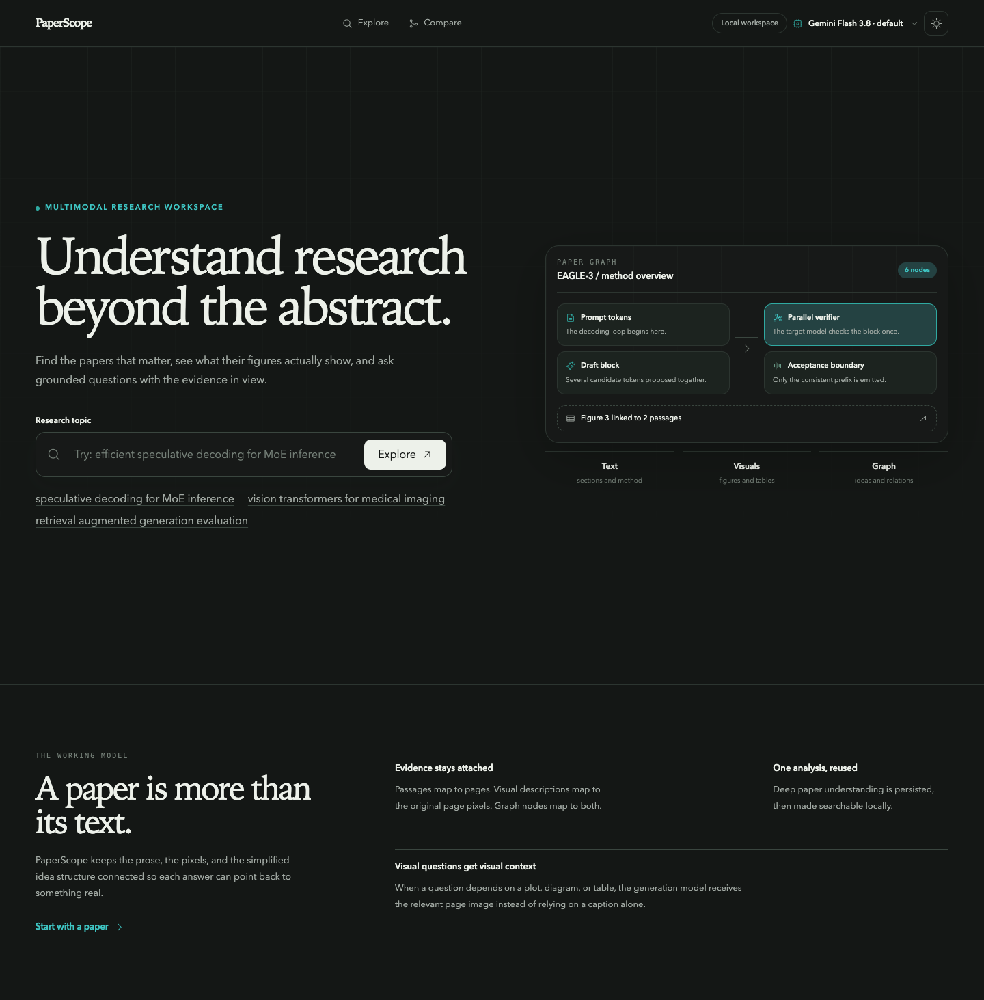
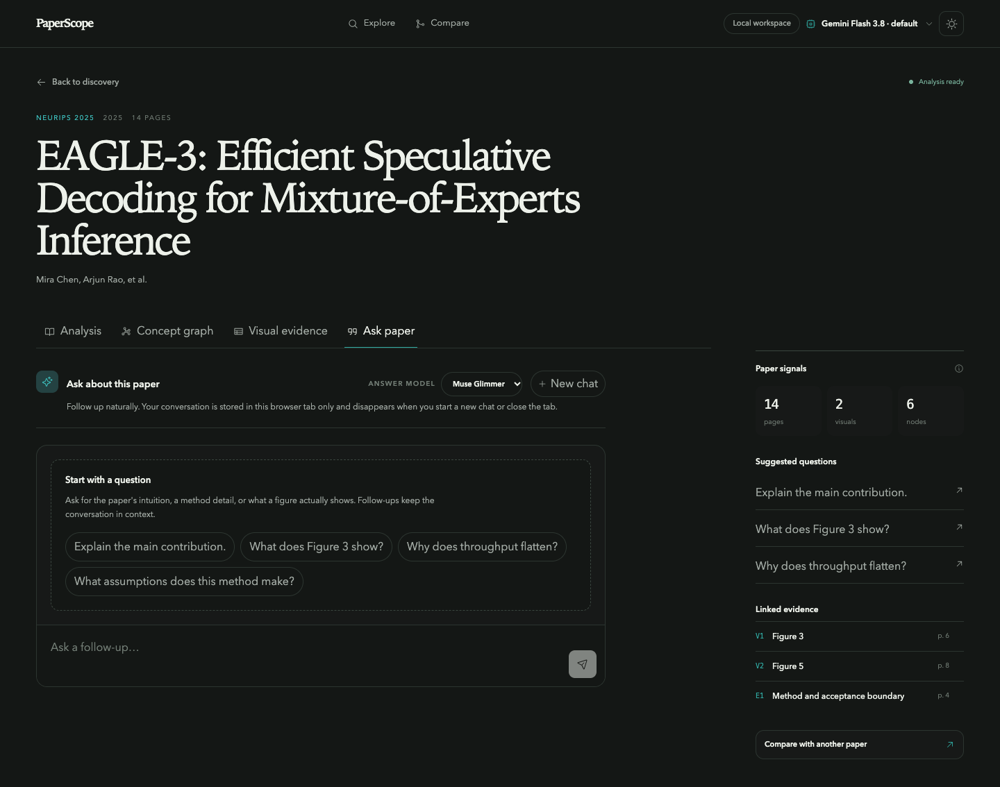
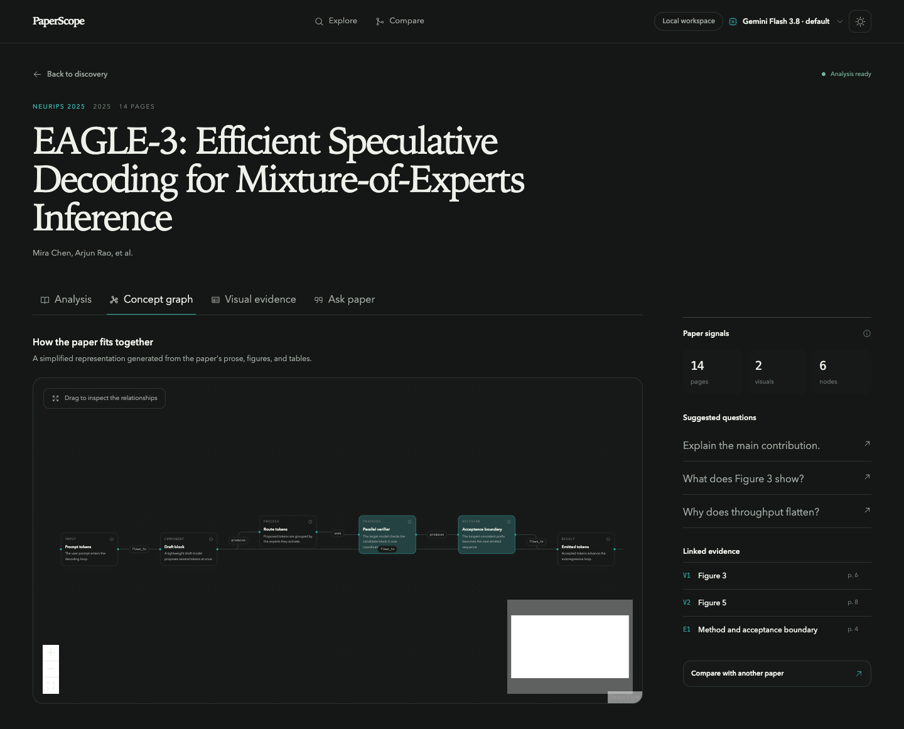
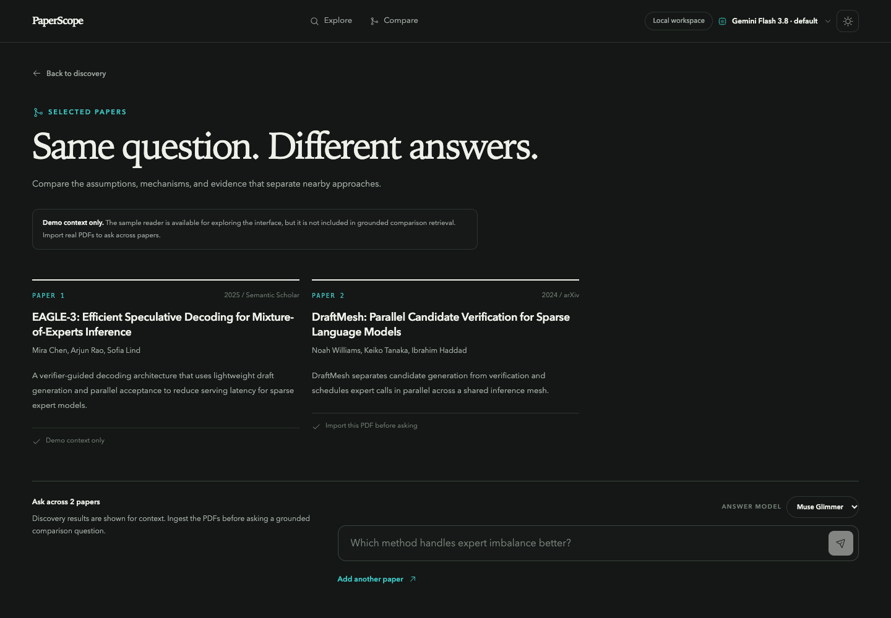
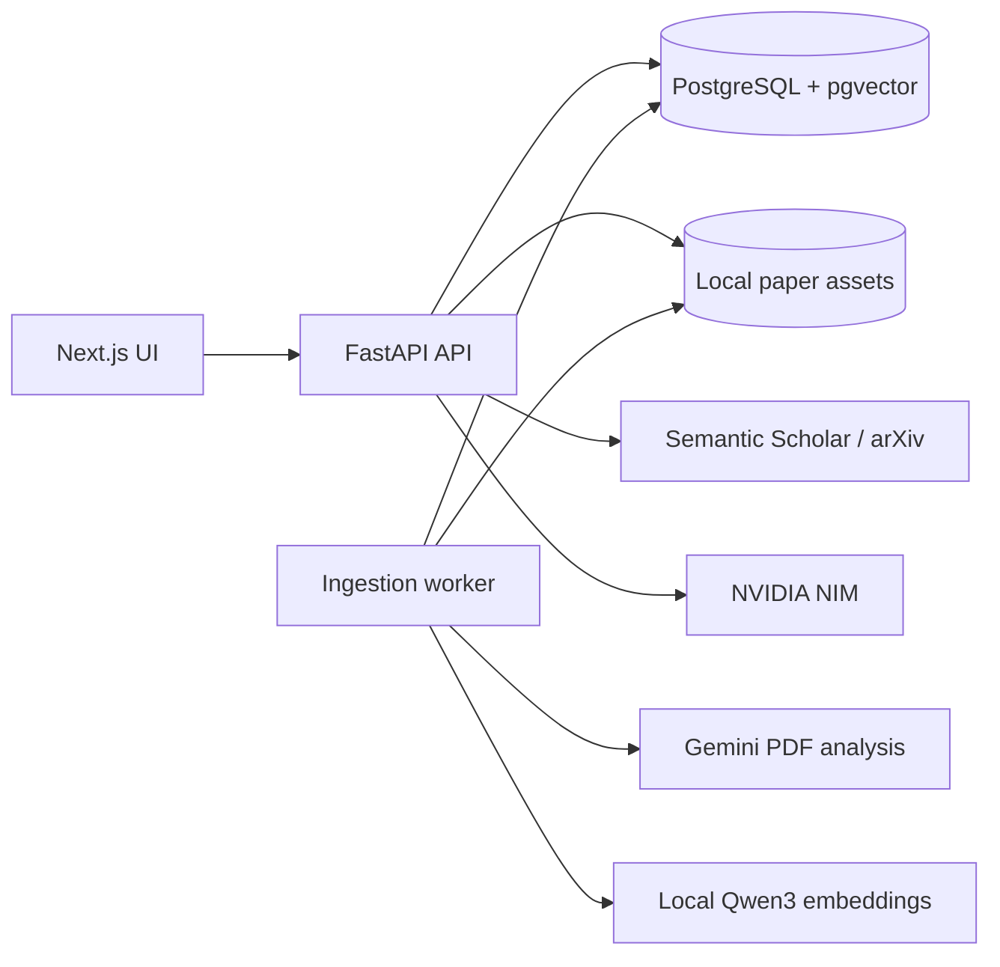

# PaperScope

> Understand research beyond the abstract.

PaperScope is a local-first workspace for discovering, indexing, comparing, and asking questions about research papers. It keeps extracted text, rendered page images, visual explanations, concept graphs, and retrieval embeddings tied to the original PDF so answers can point back to the evidence that appears in the paper.

PaperScope is currently an early-stage, single-user project intended to run on a developer machine. It is not hardened for public internet exposure.

## What it does

- Searches Semantic Scholar when configured and falls back to public arXiv search.
- Deduplicates and reranks research results before ingestion.
- Accepts PDF uploads or supported paper URLs and processes them asynchronously.
- Extracts text and page mappings with PyMuPDF and renders every page for visual evidence.
- Uses Gemini for one structured, native-PDF analysis per paper hash and prompt version.
- Creates local Qwen3 embeddings for text chunks, visual descriptions, and graph nodes.
- Retrieves evidence with cosine similarity through PostgreSQL and pgvector.
- Sends page images to the RAG model only when the retrieved evidence calls for them.
- Answers follow-up questions in a browser-persisted chat with paper and page citations.
- Compares up to three papers while preserving paper attribution.

## Screenshots

The paper, concept graph, and comparison views below use PaperScope's built-in sample content to demonstrate the interface; they are not live model responses or locally ingested papers.

<p align="center">
  
</p>

<p align="center">
  
</p>

<p align="center">
  
</p>

<p align="center">
  
</p>

## Architecture



The recommended Apple Silicon setup runs PostgreSQL in Docker while the API, worker, and web app run on the host. This lets Qwen use MPS. A full Docker profile is available as a reproducible CPU-only fallback.

## Requirements

- macOS or Linux
- Docker with Docker Compose
- Node.js 22
- Corepack, which provides the project-pinned pnpm version
- Conda or Miniforge
- A Gemini API key for paper analysis
- An NVIDIA API key for Muse/Nemotron answers and optional discovery reranking (Gemma 4 can answer with the Google AI key)
- Optional: a Semantic Scholar API key. Search still works through arXiv without one.

The default local embedding model is `Qwen/Qwen3-Embedding-0.6B`. Its first use downloads model weights, so startup and the first ingestion can take longer than later runs.

## Quick start

### 1. Configure the environment

```bash
cp .env.example .env
```

Open `.env` and set the provider keys you plan to use:

```dotenv
GOOGLE_AI_API_KEY=
NVIDIA_API_KEY=
SEMANTIC_SCHOLAR_API_KEY=
```

`SEMANTIC_SCHOLAR_API_KEY` is optional. Never commit `.env`; it is excluded by `.gitignore`.

### 2. Install dependencies

```bash
conda env create -f environment.yml
corepack enable pnpm
pnpm --version
pnpm install --frozen-lockfile
```

The repository pins pnpm 11.19.0 in `package.json`; Corepack selects that version when you run pnpm from this project. If `corepack` itself is missing, install it with `npm install --global corepack`, then rerun `corepack enable pnpm`. If the shim cannot be added to your Node installation, use `corepack pnpm install --frozen-lockfile` for dependency installation.

If the `PaperScope` Conda environment already exists, update it instead:

```bash
conda env update -n PaperScope -f environment.yml --prune
```

### 3. Start PostgreSQL

```bash
make db
```

The database listens only on `127.0.0.1:5432`. Its Docker volume persists across restarts.

### 4. Start the application

Run each command in a separate terminal from the repository root:

```bash
make api
```

```bash
make worker
```

```bash
make web
```

Open [http://127.0.0.1:3000](http://127.0.0.1:3000). The API documentation is available at [http://127.0.0.1:8000/docs](http://127.0.0.1:8000/docs).

Check service health with:

```bash
curl http://127.0.0.1:8000/health/live
curl http://127.0.0.1:8000/health/ready
```

## Full Docker setup

To run the database, API, worker, and frontend in containers:

```bash
docker compose --profile full up --build
```

This profile uses CPU embeddings. On Apple Silicon, the host setup above is usually faster because it can use MPS.

Stop the stack without deleting the database volume:

```bash
docker compose --profile full down
```

## How to use PaperScope

1. Open **Explore** and search for a topic. Semantic Scholar registration is not required; the API key only improves access limits and reliability.
2. Select a paper and start ingestion, or upload a local PDF.
3. Keep the worker running while PaperScope extracts, renders, analyzes, and embeds the paper.
4. Open the paper workspace to switch between Simple, Student, Researcher, Visual, Graph, and Ask Paper views.
5. Ask follow-up questions in the chat. Text questions use retrieved embeddings; visual questions also attach the relevant page or crop to the model.

New ingestions default to Gemini Flash 3.8. Retryable failures follow the selected model chain, descending through the available Gemini Flash versions and ending with Gemma 4. Gemini analyzes the original PDF natively; the Gemma fallback analyzes extracted, page-numbered text plus compressed local page images in resumable batches. Qwen embeddings run after either analysis path.

```text
Gemini Flash 3.8 -> Gemini Flash 3.7 -> Gemini Flash 3.6 -> Gemini Flash 3.5 -> Gemma 4
```

Ask Paper and Compare share an answer-model choice saved in browser storage. The chosen provider is attempted first, followed by the remaining providers in Muse Glimmer → Nemotron → Gemma 4 order. Providers without their required API key are skipped. The 60-second RAG request limit is shared across retries and fallbacks; each answer receives the same retrieved evidence, chat history, and relevant page images.

## Configuration

The complete development template is in [`.env.example`](.env.example). Important settings include:

| Variable | Purpose | Default |
| --- | --- | --- |
| `DATABASE_URL` | PostgreSQL connection string | Local PaperScope database |
| `PAPERS_ROOT` | Canonical PDF and rendered-page storage | `./data/papers` |
| `GOOGLE_AI_API_KEY` | Gemini document analysis credential | Required for ingestion |
| `PAPER_ANALYSIS_MODEL` | Preferred Gemini indexing model | `gemini-3.8-flash` |
| `GEMINI_MODEL_MAX_RETRIES` | Additional attempts per Gemini model | `2` |
| `GEMMA_ANALYSIS_MAX_RETRIES` | Additional attempts per Gemma indexing batch/final analysis | `2` |
| `GEMMA_ANALYSIS_PROMPT_VERSION` | Cache version for the Gemma indexing fallback | `gemma-pages-v1` |
| `NVIDIA_API_KEY` | NVIDIA NIM credential | Required for Muse/Nemotron answers |
| `NIM_BASE_URL` | OpenAI-compatible NIM endpoint | NVIDIA hosted API |
| `RAG_PRIMARY_MODEL` | Primary answer model | Muse Glimmer |
| `RAG_FALLBACK_MODEL` | Fallback answer model | Nemotron |
| `RAG_GEMMA_MODEL` | Gemma RAG answer model | `gemma-4-31b-it` |
| `RAG_GEMMA_MAX_RETRIES` | Additional attempts for Gemma RAG answers | `1` |
| `RAG_PROVIDER_TIMEOUT_SECONDS` | Timeout for each provider attempt | `18` |
| `EMBEDDING_MODEL` | Local sentence-transformer model | Qwen3 0.6B |
| `EMBEDDING_DEVICE` | Embedding device selection | `auto` |
| `SEMANTIC_SCHOLAR_API_KEY` | Optional discovery credential | Empty |
| `DISCOVERY_TIMEOUT_SECONDS` | Total search deadline | `20` |

Retry settings count additional retries. For example, a value of `2` allows up to three attempts for that model.

## Data and privacy

- Original PDFs, page images, and derived assets are stored under `data/papers/` and are excluded from Git.
- PostgreSQL data lives in a named Docker volume and is excluded from Git.
- Google AI receives the original PDF for native Gemini analysis, or extracted text and rendered page images in bounded batches if Gemma indexing fallback is needed.
- NVIDIA NIM receives retrieved evidence and only receives page images when visual evidence is needed.
- Qwen embeddings run locally on MPS, CUDA, or CPU.
- Provider credentials remain in the backend environment and are never sent to the browser.
- The API binds to localhost by default. Add authentication and a production security review before exposing it to a network.

## Development checks

Run the backend tests:

```bash
make test
```

Run Python and frontend linting:

```bash
make lint
```

Run the TypeScript check and production frontend build:

```bash
make typecheck
pnpm build
```

Validate the Compose configuration:

```bash
docker compose config --quiet
```

The backend tests mock external model providers. Live Gemini and NVIDIA calls require valid credentials and may incur provider charges.

## Repository layout

```text
.
├── apps/web/                 Next.js App Router frontend
├── db/migrations/            PostgreSQL and pgvector schema
├── services/backend/         FastAPI API and ingestion worker
│   ├── paperscope/processing PDF extraction and ingestion stages
│   ├── paperscope/providers  Gemini, Qwen, discovery, and NIM adapters
│   ├── paperscope/rag        Retrieval and grounded-answer pipeline
│   └── tests/                Backend unit and integration-style tests
├── data/papers/              Local PDFs and rendered assets; ignored
├── docker-compose.yml        Database and full-stack profile
└── environment.yml           Host Python environment
```

## Current limits

- Single-user, localhost-only workflow
- PDFs up to 100 MB and 200 pages
- Up to three papers in one comparison
- No guaranteed OCR path for image-only scanned PDFs
- Provider model names, quotas, and availability can vary by account
- No authentication, billing, collaboration, or cloud deployment support

## Contributing

Issues and pull requests are welcome. Please keep provider calls behind the backend adapters, avoid committing generated paper assets, and run the development checks before opening a pull request.

When reporting a provider failure, remove API keys, PDF content, local file paths, and other private data from logs and screenshots.

## License

PaperScope is licensed under the [GNU Affero General Public License v3.0](LICENSE). If you modify PaperScope and make it available to users over a network, you must also make the corresponding source code available under the same license.
